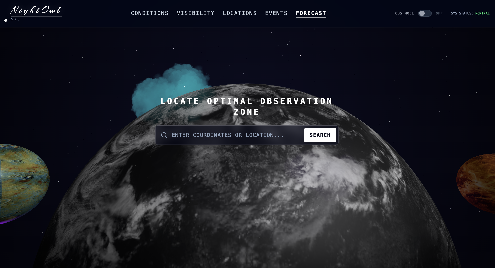
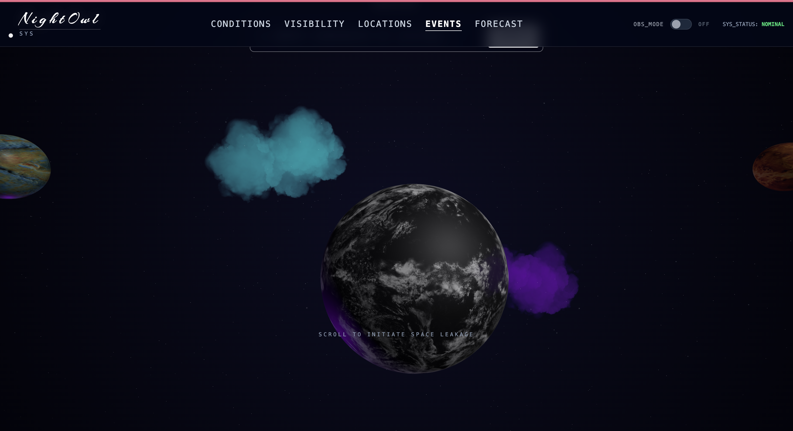
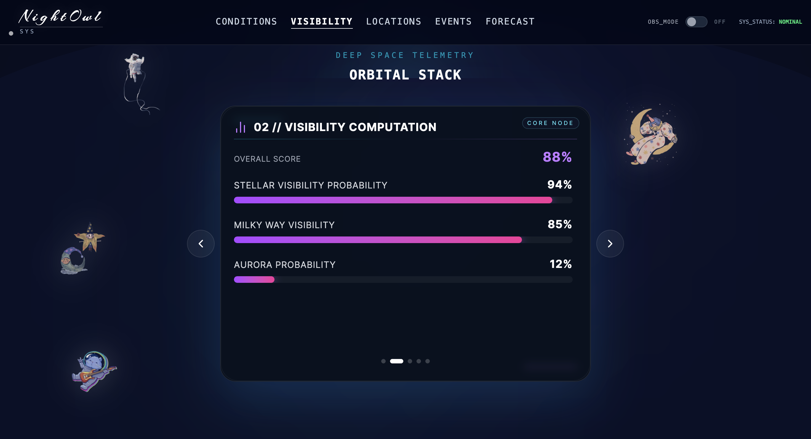
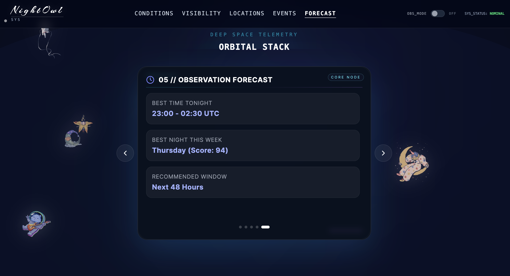
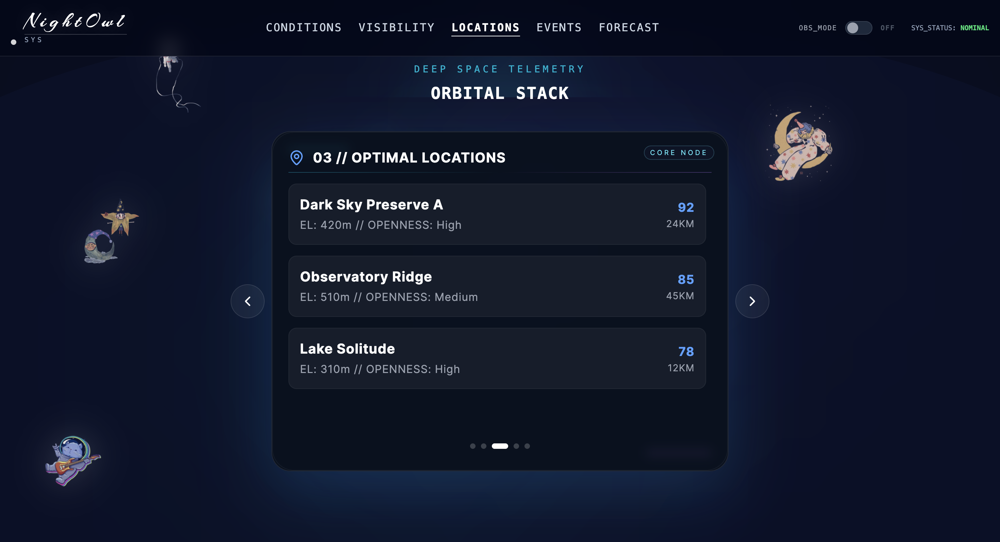

<<<<<<< HEAD
# NightOwl / SkyLens 3D

This project integrates a **FastAPI backend** with a **React + Vite 3D frontend** for an immersive astrophotography planning experience.

## Project Structure

- **Frontend**: React, Vite, Three.js (React Three Fiber), Framer Motion, Tailwind CSS.
- **Backend**: FastAPI, Skyfield, Gemini AI, Open-Meteo.

## Backend Setup

1.  **Install dependencies**:
    ```bash
    python -m venv venv
    source venv/Scripts/activate  # On Windows: venv\Scripts\activate
    pip install -r requirements.txt
    ```

2.  **Run the server**:
    ```bash
    uvicorn main:app --reload
    ```
    The server runs on `http://127.0.0.1:8000`.

## Frontend Setup
=======
# 🌌 Night Owl — 3D Stargazing Intelligence Backend

FastAPI backend for **Night Owl (SkyLens 3D)** — an astrophotography planning engine that combines weather, astronomy, light pollution, and aurora data into a single **visibility score**.

---

## 🖼️ Preview

### 🌍 Main Dashboard



---

### 🌌 3D Sky Visualization



---

### 📊 Visibility Score System



---

### 🔍 AI Sky Search



---

### 📍 Location Optimization Results



---

## 🚀 Overview

Night Owl solves the core problem of stargazing:

> *Where should I go right now for the best sky visibility?*

It evaluates multiple real-world factors and returns optimized results for:

* Milky Way photography
* Aurora viewing
* Deep sky observation
* Night sky exploration

---

## ⚙️ Tech Stack

**Backend**

* FastAPI
* Python
* AsyncIO

**Libraries**

* Skyfield (astronomy calculations)
* Requests
* Pydantic
* Python-dotenv

---

## 📦 Installation

```bash
python -m venv venv
source venv/Scripts/activate   # Windows Git Bash
pip install -r requirements.txt
uvicorn main:app --reload
```

Server runs at:

```
http://127.0.0.1:8000
```

---

## 📚 API Docs

Swagger UI:
>>>>>>> origin/main

1.  **Install dependencies**:
    ```bash
    npm install
    ```

2.  **Run the development server**:
    ```bash
    npm run dev
    ```

<<<<<<< HEAD
## API Endpoints
=======
```
http://127.0.0.1:8000/redoc
```

---
>>>>>>> origin/main

## 🔌 API Endpoints

<<<<<<< HEAD
## Features

- **3D Visualization**: Immersive space environment with planets and stars.
- **Real-time Data**: Weather, light pollution, and celestial event tracking.
- **AI Assistant**: Natural language queries for planning your observation nights.
=======
| Method | Endpoint                | Description                             |
| ------ | ----------------------- | --------------------------------------- |
| GET    | `/`                     | Health check                            |
| POST   | `/api/plan`             | Full sky plan for a given time/location |
| POST   | `/api/future`           | Best viewing windows over upcoming days |
| POST   | `/api/nearby`           | Nearby optimized locations              |
| POST   | `/api/sky`              | 3D sky visualization data               |
| POST   | `/api/astronomy`        | Planetary + celestial calculations      |
| POST   | `/api/aurora`           | Aurora forecast                         |
| POST   | `/api/events`           | Night sky highlights                    |
| POST   | `/api/upcoming-moments` | Key observation moments                 |
| POST   | `/api/ai-search`        | Natural language sky assistant          |
| POST   | `/api/location-search`  | Geolocation + search                    |

---

## 🧠 AI Search

Natural language queries like:

```json
{
  "query": "Best time to see the Milky Way tonight in Kitchener",
  "latitude": 43.4516,
  "longitude": -80.4925
}
```

Returns:

* Parsed intent
* Optimized plan
* AI-generated explanation

---

## 🔑 Environment Setup

Create `.env` file:

```env
GEMINI_API_KEY=your-key-here
GEMINI_MODEL=gemini-2.0-flash
```

---

## 📡 Data Sources

* Weather → Open-Meteo
* Astronomy → Skyfield (JPL Ephemeris)
* Light Pollution → OpenStreetMap
* Aurora → NOAA SWPC
* Geocoding → OpenStreetMap Nominatim
* AI → Google Gemini

---

## 📁 Project Structure

```bash
app/
  main.py
  routes/
  services/
  models/
```

---

## 🛠️ Features

* 🌌 Real-time astronomy calculations
* 🌦️ Weather-based visibility scoring
* 🌃 Light pollution analysis
* 🌌 Aurora prediction
* 📍 Location optimization engine
* 🧠 AI-powered sky assistant

---

## 🧪 Health Check

```bash
GET /
```

Response:

```json
{
  "message": "SkyLens 3D Backend Running",
  "status": "healthy"
}
```

---

## 📜 License

MIT License

---

## 👨‍💻 Author

**Janasi Rajput, Manasi Rajput, Chan Gaganjeet, Khushbu**
Night Owl / SkyLens Project


>>>>>>> origin/main
